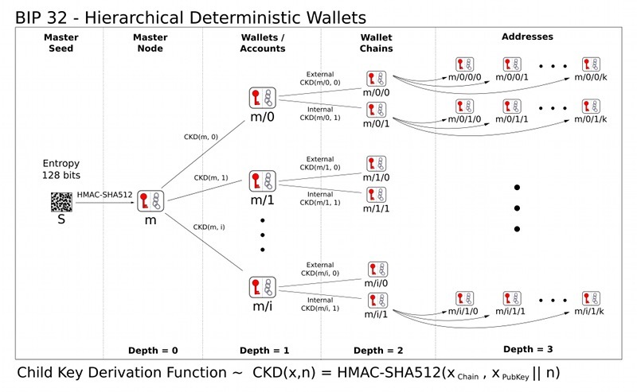

1. bip32:  BIP 32 是比特币改进提案。

    链接：<A href="https://github.com/bitcoin/bips/blob/master/bip-0032.mediawiki">https://github.com/bitcoin/bips/blob/master/bip-0032.mediawiki</a>

   address(钱包地址)定义了如何从二进制主种子和有序索引集导出钱包的私钥和公钥

   >钱包的可恢复性得到改善，因为单个种子可以恢复整个钱包

   >***种子是一段数据，可用于生成钱包中的所有私钥和公钥。通常表示为助记词***

+ HD 钱包

   分层确定性钱包是用于描述使用种子派生许多公钥和私钥的钱包的术语。这些密钥以确定性方式生成，用于发送和接收比特币

    

2. bip39: BIP 39是比特币改进提案，引入了助记词标准

   链接：<a href="https://github.com/bitcoin/bips/blob/master/bip-0039.mediawiki">https://github.com/bitcoin/bips/blob/master/bip-0039.mediawiki</a>

   > 描述：一组易于记忆的单词（12-24 个单词）——用于生成确定性钱包的实现。

   >***它由两部分组成：生成助记词和将其转换为二进制种子。该种子稍后可用于使用 BIP-0032 或类似方法生成确定性(HD)钱包。***

   >二进制生成方法：***为了从助记符创建二进制种子，我们使用 PBKDF2 函数，助记语句（在 UTF-8 NFKD 中）用作密码，字符串“助记符”+密码短语（同样在 UTF-8 NFKD 中）用作盐。迭代计数设置为 2048，HMAC-SHA512 用作伪随机函数。派生密钥的长度为 512 位（= 64 字节）***

3. bip44: 比特币改进提案 (BIP) 44 定义了生成支付公钥哈希 (P2PKH) 地址的钱包的标准推导路径。实施该标准是为了确保 HD 钱包可以导入扩展密钥并找到存储在该钱包中的比特币

   > bip44 增加了一个代币类型

    <a href="https://github.com/bitcoinjs/bip44-constants">https://github.com/bitcoinjs/bip44-constants</a>

4. bip49:

5. bip84: